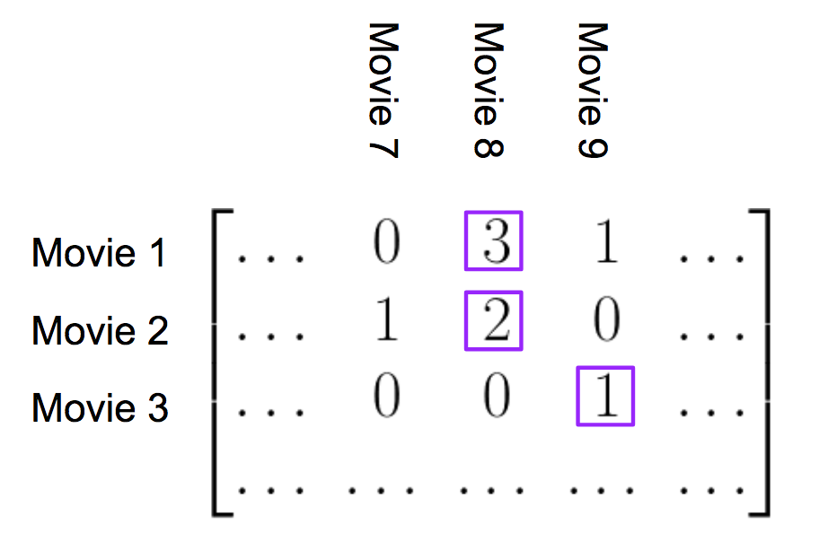

## Project Title
Recommendations_with_IBM (SVD project)

## by Fan Li

## Date created
Project is created on 2020 Jun 23.

## Table of Contents
1. [Description](#description)
2. [Workflow](#Workflow)
	1. [Exploratory Data Analysis](#eda)
	2. [Rank Based Recommendations](#rbr)
	3. [User-User Based Collaborative Filtering](#ubr)
	4. [Content Based Recommendations (EXTRA - NOT REQUIRED)](#cbr)
	5. [Matrix Factorization](#mf)
3. [Dataset](#Dataset)
4. [Summary of Project](#summary)
5. [Files](#About)
6. [Software used](#Software)

## Description
For this project I analyzed the interactions that users have with articles on the IBM Watson Studio platform, and make recommendations to them about new articles they will like. Below you can see an example of what the dashboard could look like displaying articles on the IBM Watson Platform.

Though the above dashboard is just showing the newest articles, you could imagine having a recommendation board available here that shows the articles that are most pertinent to a specific user.

In order to determine which articles to show to each user, I performed a study of the data available on the IBM Watson Studio platform.

## Workflow:

##### 1. Exploratory Data Analysis
Get insight of the datasets I will be working with.

##### 2. Rank Based Recommendations
To get started in building recommendations, first find the most popular articles simply based on the most interactions. Since there are no ratings for any of the articles, it is easy to assume the articles with the most interactions are the most popular. These are then the articles we might recommend to new users (or anyone depending on what we know about them).

##### 3. User-User Based Collaborative Filtering
In order to build better recommendations for the users of IBM's platform, we could look at users that are similar in terms of the items they have interacted with. These items could then be recommended to the similar users. This would be a step in the right direction towards more personal recommendations for the users.

##### 4. Content Based Recommendations (EXTRA - NOT REQUIRED)
After investigating `df_content` I found out there are only 437 ids show in both dataframes, leaves 277 ids in `df` but not in `df_content`. Therefor I decided to use `df` 'title' column to preform Content Based Recommendations.

###### Workflow

* NLP
    * remove punctuation and stop words (eng)
    * stem words
    * Tfidf vectorize
* Create dot prodcut of article_id * article_id
* Sort dot product of given article_id after excluding article_id itself in descending order
* Return result
    * for cold start issue (new user): return top rank articles for cold start issue (new user)
    * for user id in data base: return descending ordered result after excluding articles uer interacted already

If we can map a better relationship between two data frames, we can consider performing NLP technique on doc_body, this might imporve dot product accuracy which will imporve recommendation results.

##### 5. Matrix Factorization
Completded a machine learning approach to building recommendations. Using the user-item interactions, I built out a matrix decomposition. Using the decomposition, we can get an idea of how well we can predict new articles an individual might interact with (spoiler alert - it isn't great). Last part to discuss which methods to use moving forward, and how to test how well the recommendations are working for engaging users.

## Dataset

* `articles_community.csv`: article details
* `user-item-interactions.csv`: user interactions with articles

## Summary of Project

1. If we were given a new user, any ranked based algorithem would work like get_top_article_ids or get_top_articles function. Another way we can approach this cold start problem is to use a knowledge base recommend system. Let the new user filter out article type, post time, view numbers etc. then we give back the top ranked articles accordingly.

2. Here we can use SVD becuase there is no missing values in our user_item matrix. we only care about if an user interacted with each article, so there are only binary values to represent yes or no. In the lesson though, user-item matrix is a table contains ranked values each user scored each movie, we can't simply assign a score to a missing value, that will be unfairly represents how popular the movie is and it will affect our recommendation system accuracy.
3. When we use small amount of latent features, most of values will be predicted 0 as no interaction, which is likely to be true consider how spase user-item matrix is (more than 50% of users only interact with 3 or less articles). This drive the overall accuracy high. As we increase number of latent features, more values will be predicated 1 as interaction occur, this should increase the accuracy for individual users but on the other hand drive the overall accuracy down.

Given the circumstances like this, we can consider run an A/B test to see if our KPI increase. This means we will also need to consider other KPI to measure user retention. Some examples like:

* user engagement score
* DAU (daily activity user)
* churn rate
* user research times
* article likes/shares/bookmarks
* OEC

**...**

  These datas can either be collected backend, use UER (user experience research), focus group or survey.

## Files In The Repository
+ [`Jupyter Notebook file`](https://github.com/victorlifan/Recommendations_with_IBM/blob/master/Recommendations_with_IBM.ipynb): workspace where I performed the works.
+ [`data`](https://github.com/victorlifan/Recommendations_with_IBM/tree/master/data): a folder contains datasets
+ [`ima`](https://github.com/victorlifan/Recommendations_with_IBM/tree/master/ima): png files were displayed in READMEs
+ `.py and .p files` support files to check answers etc.

## Software used
+ Jupyter Notebook
+ Atom
+ Python 3.7
> + Sklearn
> + Numpy
> + pandas
> + matplotlib

## Credits
+ Data provided by: IBM through [DATA SCIENTIST NANODEGREE PROGRAM](https://www.udacity.com/course/data-scientist-nanodegree--nd025)
+ Instruction and assist: [DATA SCIENTIST NANODEGREE PROGRAM](https://www.udacity.com/course/data-scientist-nanodegree--nd025)
